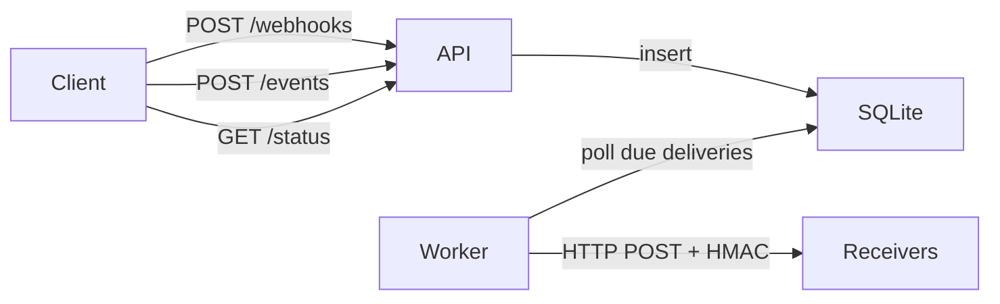

# Webhook Delivery Production MVP

Build a Node/TypeScript Express webhook delivery service with SQLite persistence, async at-least-once delivery, HMAC signing, retries, Jest harness, and a `/status` observability endpoint.

## Locked decisions

- **Stack**: Node.js + TypeScript + Express
- **Interface**: HTTP API
- **Semantics**: at-least-once; ingest returns **202** after persisting event + delivery rows
- **Storage / queue**: SQLite + in-process poller/worker (no Redis)
- **Retries**: network/timeout/5xx/429; permanent fail on other 4xx; exponential backoff + jitter; max **5** attempts; **5s** HTTP timeout
- **Auth**: per-webhook secret; HMAC-SHA256 body signature on every delivery
- **Observability**: structured JSON logs + `GET /status`
- **Harness**: Jest + ephemeral local receivers (happy path + retry-then-success)
- **Testing**: write Jest tests **alongside** each feature (unit + route tests first; e2e harness last), not as a final phase

## Architecture



**Ingest path**: validate → insert `events` row → for each active webhook insert a `deliveries` row (`pending`, `next_attempt_at = now`) → return `202 { eventId }`.

**Worker**: loop (e.g. every 500ms): claim due `pending`/`retrying` rows (transactional claim to avoid double-send in one process), POST payload, record attempt, mark `delivered` / schedule retry / mark `dead`.

## Data model (SQLite)

- **webhooks**: `id`, `url`, `secret`, `created_at`, `active`
- **events**: `id`, `payload` (JSON text), `created_at`
- **deliveries**: `id`, `event_id`, `webhook_id`, `status` (`pending`|`retrying`|`delivered`|`dead`), `attempt_count`, `next_attempt_at`, `last_status_code`, `last_error`, `updated_at`

Use `better-sqlite3` (sync, simple, durable). Schema via a small SQL migration run on boot.

## HTTP API

| Method | Path | Behavior |
| ------ | ---- | -------- |
| `POST` | `/webhooks` | Body `{ url }` → generate secret → `{ id, url, secret }` |
| `GET` | `/webhooks` | List registered webhooks (omit secrets or mask) |
| `POST` | `/events` | Body `{ payload }` or raw JSON object → persist + enqueue → `202 { eventId }` |
| `GET` | `/events/:id` | Event + delivery statuses |
| `GET` | `/status` | Counts by delivery status, recent failures, queue depth |

Delivery request to subscribers:

- `POST` to webhook URL
- Headers: `Content-Type: application/json`, `X-Webhook-Id`, `X-Event-Id`, `X-Delivery-Id`, `X-Webhook-Signature: sha256=<hex>`
- Body: `{ id: eventId, createdAt, data: <payload> }` (stable shape for HMAC)

HMAC: `HMAC-SHA256(secret, rawBodyBytes)` — sign the exact bytes sent.

## Project layout

```
src/
  index.ts              # boot server + worker
  app.ts                # Express app
  db.ts                 # SQLite open + migrate
  routes/
    webhooks.ts
    events.ts
    status.ts
  services/
    deliveryWorker.ts
    hmac.ts
    logger.ts
  types.ts
tests/
  hmac.test.ts          # signature unit tests (with hmac feature)
  webhooks.test.ts      # register/list (with routes)
  events.test.ts        # ingest + enqueue (with routes)
  deliveryWorker.test.ts# retry/dead/success (with worker)
  status.test.ts        # /status aggregates
  harness.test.ts       # e2e: receivers + register + ingest + assert
  retry.harness.test.ts # e2e: 500 then 200
README.md               # run, design, guarantees, LLM note
```

Include the required LLM ASCII **pipe** art in a source comment (per [`WEBHOOK_DELIVERY.md`](WEBHOOK_DELIVERY.md)).

## Tooling

- `typescript`, `tsx` (dev), `express`, `better-sqlite3`, `zod` (request validation), `uuid`/`crypto.randomUUID`
- Jest + `ts-jest` (or `@swc/jest`); use in-memory/temp SQLite per test; harness starts app on ephemeral port via `app.listen(0)`
- Scripts: `dev`, `start`, `test`, `build`

## Explicit non-goals (document in README)

- Multi-process / multi-host workers (claiming is single-process)
- Admin UI / Prometheus / webhook CRUD beyond register+list
- Exactly-once delivery (receivers must dedupe on `event_id`)
- SSRF hardening beyond a brief README note (optional simple blocklist of localhost only if time)

## Implementation order / to-dos

Test-as-you-go: each step lands feature code **and** its Jest coverage before moving on.

1. **scaffold** — Scaffold Node/TS Express + Jest; smoke test that app boots
2. **api-persist** — Webhooks/events routes + SQLite enqueue; unit/API tests as we go
3. **worker-hmac** — Delivery worker + HMAC + retries; unit tests for hmac/retry alongside
4. **status-logs** — JSON logger + GET /status with tests for status aggregates
5. **jest-harness** — End-to-end harness tests (happy path + retry-then-success receivers)
6. **readme** — Write README with run instructions, guarantees, design notes, pipe comment

## Success criteria

- Register URLs, ingest events, receivers get signed payloads
- Failed 5xx delivery retries then succeeds; 4xx goes dead without spinning
- `GET /status` reflects pending/delivered/dead
- `npm test` green without external services
